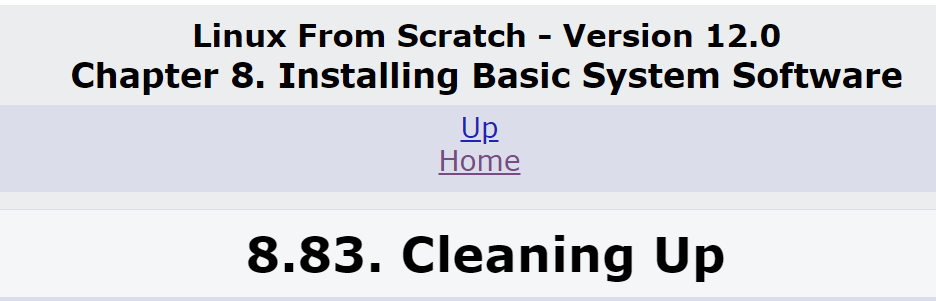

Why the fuck are there 83 subsections in this chapter???




tample
```bash
cd /sources/

tar xf PACKAGE-*.tar.xz
cd PACKAGE-*/

# Installation here

cd /sources/
rm -rf PACKAGE-*/
```


## 8.0 Entering chroot environment
#### Run as `root`
Check `$LFS` variable (make sure OK)
```bash
echo "===== ======="
echo "Check $LFS..."
if   [ -z $LFS  ] ; then 
  echo ERROR: There is no LFS variable  === ERROR ===
elif [ -d $LFS/ ] ; then
  echo === === === === === === ===  LFS is $LFS/ === OK ===
else
  echo ERROR: There is no LFS directory === ERROR ===
fi
```

Mount virtual file systems and enter chroot environment
```bash
mkdir -pv $LFS/{dev,proc,sys,run}

mount -v --bind /dev $LFS/dev
mount -v --bind /dev/pts $LFS/dev/pts
mount -vt proc proc $LFS/proc
mount -vt sysfs sysfs $LFS/sys
mount -vt tmpfs tmpfs $LFS/run

if [ -h $LFS/dev/shm ]; then
  mkdir -pv $LFS/$(readlink $LFS/dev/shm)
else
  mount -t tmpfs -o nosuid,nodev tmpfs $LFS/dev/shm
fi

chroot "$LFS" /usr/bin/env -i   \
    HOME=/root                  \
    TERM="$TERM"                \
    PS1='(lfs chroot) \u:\w\$ ' \
    PATH=/usr/bin:/usr/sbin     \
    /bin/bash --login
```