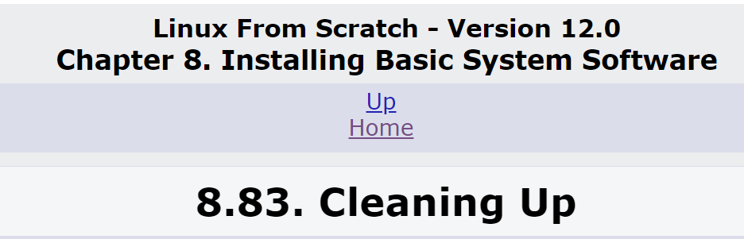

Why the fuck are there 83 subsections in this chapter???



<br>


## 8.0 Chapter 8 Setup

## 8.0.S Entering chroot environment
#### Run as `root`
Set `$LFS` variable
```bash
export LFS=/mnt/lfs
```
Check `$LFS` variable (make sure OK)
```bash
echo "===== ======="
echo "Check $LFS..."
if   [ -z $LFS  ] ; then 
  echo ERROR: There is no LFS variable  === ERROR ===
elif [ -d $LFS/ ] ; then
  echo === === === === === === ===  LFS is $LFS/ === OK ===
else
  echo ERROR: There is no LFS directory === ERROR ===
fi
```
Mount virtual file systems and enter chroot environment
```bash
mkdir -pv $LFS/{dev,proc,sys,run}

mount -v --bind /dev $LFS/dev
mount -v --bind /dev/pts $LFS/dev/pts
mount -vt proc proc $LFS/proc
mount -vt sysfs sysfs $LFS/sys
mount -vt tmpfs tmpfs $LFS/run

if [ -h $LFS/dev/shm ]; then
  mkdir -pv $LFS/$(readlink $LFS/dev/shm)
else
  mount -t tmpfs -o nosuid,nodev tmpfs $LFS/dev/shm
fi

chroot "$LFS" /usr/bin/env -i   \
    HOME=/root                  \
    TERM="$TERM"                \
    PS1='(lfs chroot) \u:\w\$ ' \
    PATH=/usr/bin:/usr/sbin     \
    /bin/bash --login
```

## 8.0.E Exiting chroot environment
When you want to exit just do this
```bash
exit
```

## 8.0.X Pre-flight Checks
Make sure you are in
`(lfs chroot) root:/sources# |`


---
## 8.3 Man-pages install
Approximate time required: x SBU
```bash
cd /sources/

time {
tar xf man-pages-*.tar.*
cd man-pages-*/

# Installation here
rm -v man3/crypt*
make prefix=/usr install
}

cd /sources/
rm -rf man-pages-*/
```

---
## 8.4 Iana-Etc install
Approximate time required: x SBU
```bash
cd /sources/

time {
tar xf iana-etc-*.tar.*
cd iana-etc-*/

# Installation here
cp services protocols /etc
}

cd /sources/
rm -rf iana-etc-*/
```

---
## 8.5 Glibc
### 8.5.1 Compile and check
Compile and run tests\
Approximate time required: x SBU
```bash
cd /sources/

time {
tar xf glibc-*.tar.*
cd glibc-*/

# Installation here
patch -Np1 -i ../glibc-2.38-fhs-1.patch
patch -Np1 -i ../glibc-2.38-memalign_fix-1.patch

mkdir -v build
cd       build

echo "rootsbindir=/usr/sbin" > configparms
../configure --prefix=/usr                            \
             --disable-werror                         \
             --enable-kernel=4.14                     \
             --enable-stack-protector=strong          \
             --with-headers=/usr/include              \
             libc_cv_slibdir=/usr/lib
make
make check;
}
```
Check last output for test results.
>A few failures out of over 5000 tests can generally be ignored.\
Examples:\
-> io/tst-lchmod\
-> stdlib/tst-arc4random-thread

### 8.5.2 Install and configure
Install and configure\
Approximate time required: x SBU
```bash
time { 
touch /etc/ld.so.conf
sed '/test-installation/s@$(PERL)@echo not running@' -i ../Makefile
make install

sed '/RTLDLIST=/s@/usr@@g' -i /usr/bin/ldd
cp -v ../nscd/nscd.conf /etc/nscd.conf
mkdir -pv /var/cache/nscd

mkdir -pv /usr/lib/locale
localedef -i POSIX -f UTF-8 C.UTF-8 2> /dev/null || true
localedef -i cs_CZ -f UTF-8 cs_CZ.UTF-8
localedef -i de_DE -f ISO-8859-1 de_DE
localedef -i de_DE@euro -f ISO-8859-15 de_DE@euro
localedef -i de_DE -f UTF-8 de_DE.UTF-8
localedef -i el_GR -f ISO-8859-7 el_GR
localedef -i en_GB -f ISO-8859-1 en_GB
localedef -i en_GB -f UTF-8 en_GB.UTF-8
localedef -i en_HK -f ISO-8859-1 en_HK
localedef -i en_PH -f ISO-8859-1 en_PH
localedef -i en_US -f ISO-8859-1 en_US
localedef -i en_US -f UTF-8 en_US.UTF-8
localedef -i es_ES -f ISO-8859-15 es_ES@euro
localedef -i es_MX -f ISO-8859-1 es_MX
localedef -i fa_IR -f UTF-8 fa_IR
localedef -i fr_FR -f ISO-8859-1 fr_FR
localedef -i fr_FR@euro -f ISO-8859-15 fr_FR@euro
localedef -i fr_FR -f UTF-8 fr_FR.UTF-8
localedef -i is_IS -f ISO-8859-1 is_IS
localedef -i is_IS -f UTF-8 is_IS.UTF-8
localedef -i it_IT -f ISO-8859-1 it_IT
localedef -i it_IT -f ISO-8859-15 it_IT@euro
localedef -i it_IT -f UTF-8 it_IT.UTF-8
localedef -i ja_JP -f EUC-JP ja_JP
localedef -i ja_JP -f SHIFT_JIS ja_JP.SJIS 2> /dev/null || true
localedef -i ja_JP -f UTF-8 ja_JP.UTF-8
localedef -i nl_NL@euro -f ISO-8859-15 nl_NL@euro
localedef -i ru_RU -f KOI8-R ru_RU.KOI8-R
localedef -i ru_RU -f UTF-8 ru_RU.UTF-8
localedef -i se_NO -f UTF-8 se_NO.UTF-8
localedef -i ta_IN -f UTF-8 ta_IN.UTF-8
localedef -i tr_TR -f UTF-8 tr_TR.UTF-8
localedef -i zh_CN -f GB18030 zh_CN.GB18030
localedef -i zh_HK -f BIG5-HKSCS zh_HK.BIG5-HKSCS
localedef -i zh_TW -f UTF-8 zh_TW.UTF-8
# INDONESIA NUMBA WAAAAAAAAAN
localedef -i id_ID -f ISO-8859-1 id_ID
localedef -i id_ID -f UTF-8 id_ID.UTF-8


cat > /etc/nsswitch.conf << "EOF"
# Begin /etc/nsswitch.conf

passwd: files
group: files
shadow: files

hosts: files dns
networks: files

protocols: files
services: files
ethers: files
rpc: files

# End /etc/nsswitch.conf
EOF

tar -xf ../../tzdata2023c.tar.gz

ZONEINFO=/usr/share/zoneinfo
mkdir -pv $ZONEINFO/{posix,right}

for tz in etcetera southamerica northamerica europe africa antarctica  \
          asia australasia backward; do
    zic -L /dev/null   -d $ZONEINFO       ${tz}
    zic -L /dev/null   -d $ZONEINFO/posix ${tz}
    zic -L leapseconds -d $ZONEINFO/right ${tz}
done

cp -v zone.tab zone1970.tab iso3166.tab $ZONEINFO
zic -d $ZONEINFO -p America/New_York
unset ZONEINFO

ln -sfv /usr/share/zoneinfo/Asia/Jakarta /etc/localtime

cat > /etc/ld.so.conf << "EOF"
# Begin /etc/ld.so.conf
/usr/local/lib
/opt/lib

EOF

cat >> /etc/ld.so.conf << "EOF"
# Add an include directory
include /etc/ld.so.conf.d/*.conf

EOF
mkdir -pv /etc/ld.so.conf.d
}


cd /sources/
rm -rf glibc-*/
```


## Continue to next section
Next section: [8.6 - 8.26](lfsch8s6-26.md)