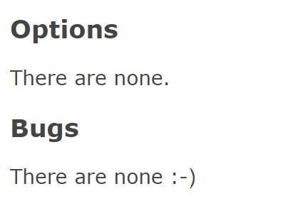

Definitely bug free and tested under production standards :))))))

[](https://linux.die.net/man/8/mklost+found)


## 8.0 Chapter 8 Setup

### 8.0.S Entering chroot environment
#### Run as `root`
Check mounted or not
```bash
findmnt | grep $LFS
```
Output if LFS **IS MOUNTED**:
```
├─/mnt/lfs                                              /dev/sdb2   ext4        rw,relatime
│ ├─/mnt/lfs/dev                                        udev        devtmpfs    rw,nosuid,relatime,size=1981744k,nr_inodes=495436,mode=755,inode64
│ │ ├─/mnt/lfs/dev/pts                                  devpts      devpts      rw,nosuid,noexec,relatime,gid=5,mode=620,ptmxmode=000
│ │ └─/mnt/lfs/dev/shm                                  tmpfs       tmpfs       rw,nosuid,nodev,relatime,inode64
│ ├─/mnt/lfs/proc                                       proc        proc        rw,relatime
│ ├─/mnt/lfs/sys                                        sysfs       sysfs       rw,relatime
│ └─/mnt/lfs/run                                        tmpfs       tmpfs       rw,relatime,inode64
```
Output if LFS **IS NOT MOUNTED**:
```
├─/mnt/lfs                                              /dev/sdb2   ext4        rw,relatime
```
Mount virtual filesystem if not mounted
```bash
mkdir -pv $LFS/{dev,proc,sys,run}

mount -v --bind /dev $LFS/dev
mount -v --bind /dev/pts $LFS/dev/pts
mount -vt proc proc $LFS/proc
mount -vt sysfs sysfs $LFS/sys
mount -vt tmpfs tmpfs $LFS/run

if [ -h $LFS/dev/shm ]; then
  mkdir -pv $LFS/$(readlink $LFS/dev/shm)
else
  mount -t tmpfs -o nosuid,nodev tmpfs $LFS/dev/shm
fi
```
Enter chroot environment
```bash
chroot "$LFS" /usr/bin/env -i   \
    HOME=/root                  \
    TERM="$TERM"                \
    PS1='(lfs chroot) \u:\w\$ ' \
    PATH=/usr/bin:/usr/sbin     \
    /bin/bash --login
```


### 8.0.E Exiting chroot environment
When you want to exit just do this
```bash
exit
```

### 8.0.X Pre-flight Checks
Make sure you are in
`(lfs chroot) root:/# |`\
Create `version-check.sh` (See [Section 7.12T](./lfsch7.md#712t-test-installations) on creating `version-check.sh`)

Run `version-check.sh` to see version requirements(Make sure all is OK)
```bash
bash version-check.sh
```

Check your “NPROC”, and “MAKEFLAGS” environment variables
```bash
echo "NPROC=$(nproc) MAKEFLAGS=$MAKEFLAGS"
```
Set `MAKEFLAGS` variable
```bash
export MAKEFLAGS='-j4'
```

### 8.0.B Backup
See [Section 7.13.2](./lfsch7.md#7132-backup) on backing up the LFS system.


---
## 8.6 Zlib install
Approximate time required: 0.03 SBU
### 8.6.1 Compile and check
```bash
cd /sources/

time {
tar xf zlib-*.tar.*
cd zlib-*/

./configure --prefix=/usr
make

make check
}
```
Expected output of `make check` contains these 3 lines (make sure OK):
```
		*** zlib test OK ***
		*** zlib 64-bit test OK ***
		*** zlib shared test OK ***
```

### 8.6.2 Install
```bash
time {
make install
rm -fv /usr/lib/libz.a
}
cd /sources/
rm -rf zlib-*/
```


---
## 8.7 Bzip2 install
Approximate time required: 0.05 SBU
```bash
cd /sources/

time {
tar xf bzip2-*.tar.*
cd bzip2-*/

patch -Np1 -i ../bzip2-1.0.8-install_docs-1.patch
sed -i 's@\(ln -s -f \)$(PREFIX)/bin/@\1@' Makefile
sed -i "s@(PREFIX)/man@(PREFIX)/share/man@g" Makefile

make -f Makefile-libbz2_so
make clean
make
make PREFIX=/usr install

cp -av libbz2.so.* /usr/lib
ln -sv libbz2.so.1.0.8 /usr/lib/libbz2.so
cp -v bzip2-shared /usr/bin/bzip2
for i in /usr/bin/{bzcat,bunzip2}; do
  ln -sfv bzip2 $i
done

rm -fv /usr/lib/libbz2.a
}

cd /sources/
rm -rf bzip2-*/
```


---
## 8.8 Xz install
Approximate time required: 0.33 SBU
### 8.8.1 Compile and run tests
```bash
cd /sources/

time {
tar xf xz-*.tar.*
cd xz-*/

./configure --prefix=/usr    \
            --disable-static \
            --docdir=/usr/share/doc/xz-5.4.4
make

make check
}
```
Expected summary of `make check`
```
============================================================================
Testsuite summary for XZ Utils 5.4.4
============================================================================
# TOTAL: 19
# PASS:  19
# SKIP:  0
# XFAIL: 0
# FAIL:  0
# XPASS: 0
# ERROR: 0
============================================================================
```
### 8.8.2 Install
```bash
time {
make install
}

cd /sources/
rm -rf xz-*/
```


---
## 8.9 Zstd install
Approximate time required: 1.08 SBU

> In the test output there are several places that indicate 'failed'. These are expected and only 'FAIL' is an actual test failure.
```bash
cd /sources/

time {
tar xf zstd-*.tar.*
cd zstd-*/

make prefix=/usr

make check

make prefix=/usr install
rm -v /usr/lib/libzstd.a
}

cd /sources/
rm -rf zstd-*/
```


---
## 8.10 File install
Approximate time required: 0.18 SBU\
Make sure no errors during installation
```bash
cd /sources/

time {
tar xf file-*.tar.*
cd file-*/

./configure --prefix=/usr
make

make check

make install
}

cd /sources/
rm -rf file-*/
```


---
## 8.11 Readline install
Approximate time required: 0.12 SBU
```bash
cd /sources/

time {
tar xf readline-*.tar.*
cd readline-*/

sed -i '/MV.*old/d' Makefile.in
sed -i '/{OLDSUFF}/c:' support/shlib-install
patch -Np1 -i ../readline-8.2-upstream_fix-1.patch

./configure --prefix=/usr    \
            --disable-static \
            --with-curses    \
            --docdir=/usr/share/doc/readline-8.2
make SHLIB_LIBS="-lncursesw"
make SHLIB_LIBS="-lncursesw" install
install -v -m644 doc/*.{ps,pdf,html,dvi} /usr/share/doc/readline-8.2
}

cd /sources/
rm -rf readline-*/
```


---
## 8.12 M4 install
Approximate time required: 0.91 SBU
### 8.12.1 Compile and run tests
```bash
cd /sources/

time {
tar xf m4-*.tar.*
cd m4-*/

./configure --prefix=/usr
make

make check
}
```
Expected summary of `make check`
```
============================================================================
Testsuite summary for GNU M4 1.4.19
============================================================================
# TOTAL: 267
# PASS:  245
# SKIP:  22
# XFAIL: 0
# FAIL:  0
# XPASS: 0
# ERROR: 0
============================================================================
```
### 8.12.2 Install
```bash
time {
make install
}

cd /sources/
rm -rf m4-*/
```


---
## 8.13 Bc install
Approximate time required: 0.11 SBU
### 8.13.1 Compile and run tests
```bash
cd /sources/

time {
tar xf bc-*.tar.*
cd bc-*/

CC=gcc ./configure --prefix=/usr -G -O3 -r
make

make test
}
```
Expected summary of `make test`
```
All dc tests passed.

***********************************************************************
All bc tests passed.

***********************************************************************
```
Make sure all test passed

### 8.13.2 Install
```bash
time {
make install
}

cd /sources/
rm -rf bc-*/
```


---
## 8.14 Flex install
Approximate time required: 0.35 SBU
### 8.14.1 Compile and run tests
```bash
cd /sources/

time {
tar xf flex-*.tar.*
cd flex-*/

# Installation here
./configure --prefix=/usr \
            --docdir=/usr/share/doc/flex-2.6.4 \
            --disable-static
make

make check
}
```
Expected summary of `make check`
```
============================================================================
Testsuite summary for the fast lexical analyser generator 2.6.4
============================================================================
# TOTAL: 114
# PASS:  114
# SKIP:  0
# XFAIL: 0
# FAIL:  0
# XPASS: 0
# ERROR: 0
============================================================================
```

### 8.14.2 Install
```bash
time {
make install
}
cd /sources/
rm -rf flex-*/
```


---
## 8.15 Tcl install
Approximate time required: 5.01 SBU
### 8.15.1 Compile and run tests
```bash
cd /sources/

time {
tar xf tcl*-src.tar.*
cd tcl*/

# Installation here
SRCDIR=$(pwd)
cd unix
./configure --prefix=/usr           \
            --mandir=/usr/share/man
make
sed -e "s|$SRCDIR/unix|/usr/lib|" \
    -e "s|$SRCDIR|/usr/include|"  \
    -i tclConfig.sh
sed -e "s|$SRCDIR/unix/pkgs/tdbc1.1.5|/usr/lib/tdbc1.1.5|" \
    -e "s|$SRCDIR/pkgs/tdbc1.1.5/generic|/usr/include|"    \
    -e "s|$SRCDIR/pkgs/tdbc1.1.5/library|/usr/lib/tcl8.6|" \
    -e "s|$SRCDIR/pkgs/tdbc1.1.5|/usr/include|"            \
    -i pkgs/tdbc1.1.5/tdbcConfig.sh
sed -e "s|$SRCDIR/unix/pkgs/itcl4.2.3|/usr/lib/itcl4.2.3|" \
    -e "s|$SRCDIR/pkgs/itcl4.2.3/generic|/usr/include|"    \
    -e "s|$SRCDIR/pkgs/itcl4.2.3|/usr/include|"            \
    -i pkgs/itcl4.2.3/itclConfig.sh
unset SRCDIR

make test
}
```
Expected summary of `make test`
```
Tests ended at Tue Aug 15 15:33:41 CDT 2023
all.tcl:	Total	34591	Passed	31165	Skipped	3426	Failed	0
Sourced 151 Test Files.
Number of tests skipped for each constraint:
	9	!ieeeFloatingPoint
	3	asyncPipeChan
	76	bigEndian
	5	bug-3057639
	49	dde
	1	dontCopyLinks
	62	emptyTest
	58	fullutf
	2	hasIsoLocale
	1	knownBadTest
	42	knownBug
	100	localeRegexp
	9	localhost_v6
	48	longIs32bit
	14	macosxFileAttr
	85	memory
	43	nonPortable
	258	notRoot
	1	notValgrind
	4	nt
	1	pairsTo4bytes
	2	pre388
	1996	serverNeeded
	1	testWithLimit
	1	testexprparser && !ieeeFloatingPoint
	1	testwinclock
	2	unthreaded
	17	utf16
	21	utf32
	2	wideBiggerThanInt
	494	win
	1	winLessThan10
	4	winVista
	2	xdev
```

### 8.15.2 Install
```bash
time {
make install
chmod -v u+w /usr/lib/libtcl8.6.so
make install-private-headers
ln -sfv tclsh8.6 /usr/bin/tclsh
mv /usr/share/man/man3/{Thread,Tcl_Thread}.3
cd ..
tar -xf ../tcl8.6.13-html.tar.gz --strip-components=1
mkdir -v -p /usr/share/doc/tcl-8.6.13
cp -v -r  ./html/* /usr/share/doc/tcl-8.6.13
}

cd /sources/
rm -rf tcl*/
```


---
## 8.16 Expect install
Approximate time required: 0.34 SBU
### 8.16.1 Compile and run tests
```bash
cd /sources/

time {
tar xf expect*.tar.*
cd expect*/

./configure --prefix=/usr           \
            --with-tcl=/usr/lib     \
            --enable-shared         \
            --mandir=/usr/share/man \
            --with-tclinclude=/usr/include
make

make test
}
```
Expected summary of `make test`
```
all.tcl:	Total	29	Passed	29	Skipped	0	Failed	0
Sourced 0 Test Files.
```
If a test fails with error message:
```
The system has no more ptys. Ask your system administrator to create more
```
Do:
1. [Exit environment](#80e-exiting-chroot-environment)
2. [Redo Chapter 7.3](./lfsch7.md#73-preparing-virtual-kernel-file-systems)
3. [Re-enter chroot](#80s-entering-chroot-environment)

### 8.16.2 Install
```bash
time {
make install
ln -svf expect5.45.4/libexpect5.45.4.so /usr/lib
}
cd /sources/
rm -rf expect-*/
```


---
## 8.17 DejaGNU install
Approximate time required: 0.15 SBU\
Compile, install and run tests\
```bash
cd /sources/

time {
tar xf dejagnu-*.tar.*
cd dejagnu-*/

mkdir -v build
cd       build
../configure --prefix=/usr
makeinfo --html --no-split -o doc/dejagnu.html ../doc/dejagnu.texi
makeinfo --plaintext       -o doc/dejagnu.txt  ../doc/dejagnu.texi
make install
install -v -dm755  /usr/share/doc/dejagnu-1.6.3
install -v -m644   doc/dejagnu.{html,txt} /usr/share/doc/dejagnu-1.6.3

make check
}

cd /sources/
rm -rf dejagnu-*/
```
Expected summary of `make check`
```
		=== runtest Summary ===

# of expected passes		300
DejaGnu version	1.6.3
Expect version	5.45.4
Tcl version	    8.6
```


---
## 8.18 Binutils install
Approximate time required: 7.88 SBU
### 8.18.1 Compile and run tests
```bash
cd /sources/

time {
tar xf binutils-*.tar.*
cd binutils-*/

mkdir -v build
cd       build
../configure --prefix=/usr       \
             --sysconfdir=/etc   \
             --enable-gold       \
             --enable-ld=default \
             --enable-plugins    \
             --enable-shared     \
             --disable-werror    \
             --enable-64-bit-bfd \
             --with-system-zlib
make tooldir=/usr

make -k check
grep '^FAIL:' $(find -name '*.log')
}
```
Expected output of `grep ...`
after running `make -k check`
```
./gold/testsuite/test-suite.log:FAIL: weak_undef_test
./gold/testsuite/test-suite.log:FAIL: initpri3a
./gold/testsuite/test-suite.log:FAIL: script_test_1
./gold/testsuite/test-suite.log:FAIL: script_test_2
./gold/testsuite/test-suite.log:FAIL: justsyms
./gold/testsuite/test-suite.log:FAIL: justsyms_exec
./gold/testsuite/test-suite.log:FAIL: binary_test
./gold/testsuite/test-suite.log:FAIL: script_test_3
./gold/testsuite/test-suite.log:FAIL: tls_phdrs_script_test
./gold/testsuite/test-suite.log:FAIL: script_test_12i
./gold/testsuite/test-suite.log:FAIL: incremental_test_2
./gold/testsuite/test-suite.log:FAIL: incremental_test_5
./gprofng/gprofng.log:FAIL: tmpdir/gp-archive
./gprofng/gprofng.log:FAIL: tmpdir/gp-collect-app_F
./gprofng/gprofng.log:FAIL: tmpdir/setpath_map
```

### 8.18.2 Install
```bash
time {
make tooldir=/usr install
rm -fv /usr/lib/lib{bfd,ctf,ctf-nobfd,gprofng,opcodes,sframe}.a
}
cd /sources/
rm -rf binutils-*/
```


---
## 8.19 GMP install
Approximate time required: 1.1 SBU
### 8.19.1 Compile and run tests
```bash
cd /sources/

time {
tar xf gmp-*.tar.*
cd gmp-*/

./configure --prefix=/usr    \
            --enable-cxx     \
            --disable-static \
            --docdir=/usr/share/doc/gmp-6.3.0
make
make html

make check 2>&1 | tee gmp-check-log
awk '/# PASS:/{total+=$3} ; END{print total}' gmp-check-log
}
```
Make sure that the final output line is a number >= 199.\
Expected output of `awk ...`
```
199
```

### 8.19.2 Install
```bash
time {
make install
make install-html
}
cd /sources/
rm -rf gmp-*/
```


---
## 8.20 MPFR install
Approximate time required: 0.76 SBU
### 8.20.1 Compile and run tests
```bash
cd /sources/

time {
tar xf mpfr-*.tar.*
cd mpfr-*/

sed -e 's/+01,234,567/+1,234,567 /' \
    -e 's/13.10Pd/13Pd/'            \
    -i tests/tsprintf.c
./configure --prefix=/usr        \
            --disable-static     \
            --enable-thread-safe \
            --docdir=/usr/share/doc/mpfr-4.2.0
make
make html

make check
}
```
Expected summary of `make check` (scroll up)
```
============================================================================
Testsuite summary for MPFR 4.2.0
============================================================================
# TOTAL: 197
# PASS:  197
# SKIP:  0
# XFAIL: 0
# FAIL:  0
# XPASS: 0
# ERROR: 0
============================================================================
```

### 8.20.2 Install
```bash
time {
make install
make install-html
}
cd /sources/
rm -rf mpfr-*/
```


---
## 8.21 MPC install
Approximate time required: 0.32 SBU
### 8.21.1 Compile and run tests
```bash
cd /sources/

time {
tar xf mpc-*.tar.*
cd mpc-*/

./configure --prefix=/usr    \
            --disable-static \
            --docdir=/usr/share/doc/mpc-1.3.1
make
make html

make check
}
```
Expected summary of `make check`
```
============================================================================
Testsuite summary for mpc 1.3.1
============================================================================
# TOTAL: 74
# PASS:  74
# SKIP:  0
# XFAIL: 0
# FAIL:  0
# XPASS: 0
# ERROR: 0
============================================================================
```

### 8.21.2 Install
```bash
time {
make install
make install-html
}
cd /sources/
rm -rf mpc-*/
```


---
## 8.22 Attr install
Approximate time required: 0.12 SBU
### 8.22.1 Compile and run tests
```bash
cd /sources/

time {
tar xf attr-*.tar.*
cd attr-*/

./configure --prefix=/usr     \
            --disable-static  \
            --sysconfdir=/etc \
            --docdir=/usr/share/doc/attr-2.5.1
make

make check
}
```
Expected summary of `make check`
```
============================================================================
Testsuite summary for attr 2.5.1
============================================================================
# TOTAL: 2
# PASS:  2
# SKIP:  0
# XFAIL: 0
# FAIL:  0
# XPASS: 0
# ERROR: 0
============================================================================
```

### 8.22.2 Install
```bash
time {
make install
}
cd /sources/
rm -rf attr-*/
```


---
## 8.23 Acl install
The book doesn't even test the package lol
> If desired, return to this package and run make check after the Coreutils package has been built.

Approximate time required: 0.11 SBU
```bash
cd /sources/

time {
tar xf acl-*.tar.*
cd acl-*/

./configure --prefix=/usr         \
            --disable-static      \
            --docdir=/usr/share/doc/acl-2.3.1
make
make install
}

cd /sources/
rm -rf acl-*/
```


---
## 8.24 Libcap install
Approximate time required: 0.04 SBU\
Make sure no fails during `make test`\
```bash
cd /sources/

time {
tar xf libcap-*.tar.*
cd libcap-*/

sed -i '/install -m.*STA/d' libcap/Makefile

make prefix=/usr lib=lib

make test

make prefix=/usr lib=lib install
}
cd /sources/
rm -rf libcap-*/
```


---
## 8.25 Libxcrypt install
Approximate time required: 0.33 SBU
### 8.25.1 Compile and run tests
```bash
cd /sources/

time {
tar xf libxcrypt-*.tar.*
cd libxcrypt-*/

./configure --prefix=/usr                \
            --enable-hashes=strong,glibc \
            --enable-obsolete-api=no     \
            --disable-static             \
            --disable-failure-tokens
make

make check
}
```
Expected summary of `make check`
```
============================================================================
Testsuite summary for xcrypt 4.4.36
============================================================================
# TOTAL: 43
# PASS:  32
# SKIP:  11
# XFAIL: 0
# FAIL:  0
# XPASS: 0
# ERROR: 0
============================================================================
```

### 8.25.2 Install
```bash
time {
make install
}
cd /sources/
rm -rf libxcrypt-*/
```


---
## 8.26 Shadow install
>Book: "This package does not come with a test suite."\
Me: :):):):):):):tada::tada::tada::tada:

Approximate time required: 0.3 SBU
```bash
cd /sources/

time {
tar xf shadow-*.tar.*
cd shadow-*/

sed -i 's/groups$(EXEEXT) //' src/Makefile.in
find man -name Makefile.in -exec sed -i 's/groups\.1 / /'   {} \;
find man -name Makefile.in -exec sed -i 's/getspnam\.3 / /' {} \;
find man -name Makefile.in -exec sed -i 's/passwd\.5 / /'   {} \;
sed -e 's:#ENCRYPT_METHOD DES:ENCRYPT_METHOD YESCRYPT:' \
    -e 's:/var/spool/mail:/var/mail:'                   \
    -e '/PATH=/{s@/sbin:@@;s@/bin:@@}'                  \
    -i etc/login.defs
touch /usr/bin/passwd
./configure --sysconfdir=/etc   \
            --disable-static    \
            --with-{b,yes}crypt \
            --with-group-name-max-length=32
make
make exec_prefix=/usr install
make -C man install-man
pwconv
grpconv
mkdir -p /etc/default
useradd -D --gid 999

}
cd /sources/
rm -rf shadow-*/
```

Choose a password for user root and set it by running:
```bash
passwd root
```


## Continue to next section
Next section: [8.27 GCC](lfsch8s27gcc.md)